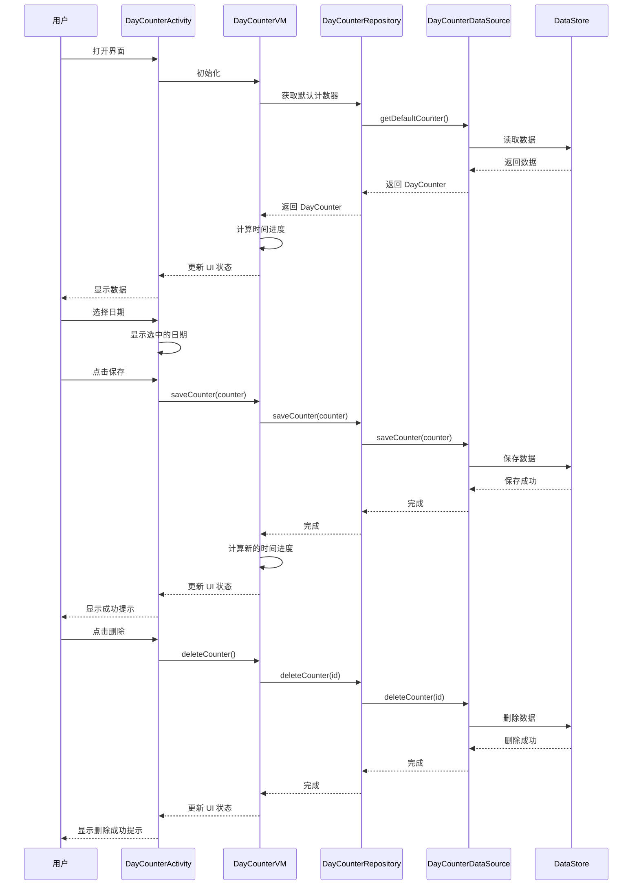

# 日期计数器功能

## 功能概述

日期计数器是一个帮助用户记录重要日期并计算时间进度的功能模块。用户可以选择一个开始日期，系统会自动计算并显示：
- 开始日期
- 距今总天数
- 距今总月数和剩余天数

## 一句话入口

用户选择开始日期后，系统自动计算并显示时间进度信息。

## 目录结构

```
features/dayscounter/
├── DayCounter.kt                    # 日期计数器主界面
├── DayCounterVM.kt                  # 日期计数器 ViewModel
├── model/
│   ├── DayCounter.kt                # 日期计数器数据模型
│   └── TimeProgress.kt              # 时间进度数据模型和计算逻辑
└── data/
    ├── DayCounterDataSource.kt      # 数据源接口
    ├── DayCounterPreferences.kt     # DataStore 实现
    └── DayCounterRepository.kt      # 数据仓库
```

## 时序图



## 使用方式

1. **启动界面**：在首页点击"日期计数"入口进入日期计数器界面
2. **选择日期**：点击"选择日期"按钮，在日期选择器中选择开始日期
3. **输入标题**（可选）：在标题输入框中输入备注信息
4. **保存**：点击"保存"按钮保存数据
5. **查看进度**：保存后会显示时间进度卡片，包含：
   - 开始日期
   - 距今总天数
   - 距今总月数和剩余天数
6. **删除**：点击"删除"按钮可以删除当前计数器

## 核心组件说明

### DayCounterActivity
- 负责界面展示和用户交互
- 使用 DatePickerDialog 进行日期选择
- 监听 ViewModel 的状态变化并更新 UI

### DayCounterVM
- 管理日期计数器的业务逻辑
- 调用 TimeProgress 进行日期计算
- 持有 UI 状态流供 Activity 观察

### TimeProgress
- 提供日期计算逻辑
- 处理各种日期边界情况（跨年、跨月、天数溢出等）
- 返回格式化的时间进度数据

### DayCounterRepository
- 协调数据源，提供业务层数据访问
- 封装数据持久化细节

### DayCounterPreferences
- 基于 DataStore 的数据持久化实现
- 使用 LocalDate.toString() 进行日期存储

## 依赖注入

在 `AppContainer` 中配置了以下依赖：

```kotlin
val dayCounterDataSource: DayCounterDataSource
val dayCounterRepository: DayCounterRepository
```

## 测试

测试文件：`DaysCounterTest.kt`

测试覆盖：
- TimeProgress 日期计算逻辑的各种边界情况
- DayCounterRepository 数据操作
- DayCounterVM 业务逻辑和状态管理

运行测试：
```bash
./gradlew testDebugUnitTest
```

## 注意事项

1. 使用 `java.time.LocalDate` 进行日期操作，需要 Android API 26+
2. DataStore 文件名：`day_counter_preferences.pb`
3. 默认计数器 ID：`day_counter_default`
4. 所有数据操作都在 IO 调度器上执行
5. 日期格式化使用中国地区格式：`yyyy-MM-dd`