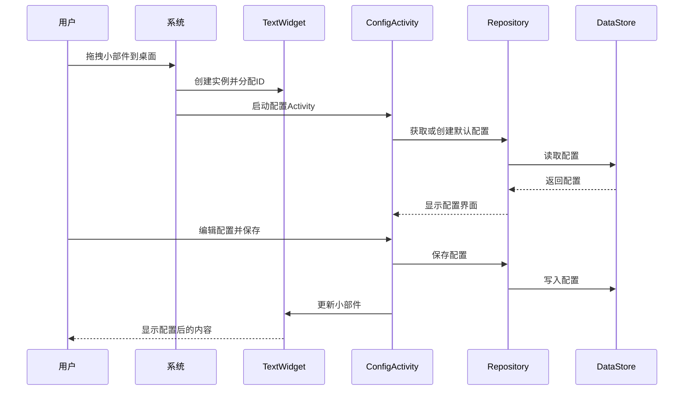
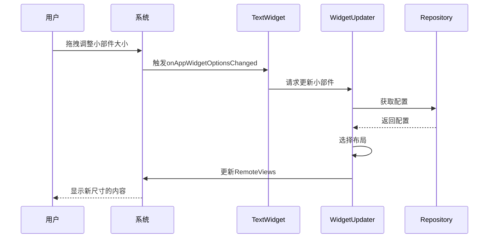

# Widget功能文档

## 功能概述

文本小部件（Widget）是一个Android桌面小组件，支持多实例和自适应大小。用户可以在桌面上放置多个小部件，每个小部件可以独立配置文本内容、字体大小、字体颜色和背景颜色。

## 主要特性

- ✅ **多实例支持** - 可在桌面放置多个独立配置的小部件
- ✅ **自适应大小** - 支持2x2、4x2、4x4三种尺寸，用户可自由调整
- ✅ **自定义内容** - 文本、字体大小、字体颜色、背景颜色
- ✅ **实时预览** - 配置界面提供实时预览
- ✅ **本地存储** - 使用DataStore轻量级存储配置

## 入口说明

### 用户入口

1. **添加小部件**
   - 长按桌面空白处
   - 选择"小部件"
   - 找到"Memory"小部件
   - 拖拽到桌面

2. **配置小部件**
   - 添加小部件后自动打开配置界面
   - 输入提示文字
   - 调整字体大小（10-40sp）
   - 选择文字颜色和背景颜色
   - 点击"保存"按钮

3. **重新配置**
   - 长按小部件
   - 删除后重新添加

### 开发者入口

**核心类入口**: `com.quanneng.memory.features.widget.widget.TextWidget`

小部件生命周期由AppWidgetProvider管理，主要事件：
- `onUpdate()` - 小部件更新时
- `onDeleted()` - 小部件删除时
- `onAppWidgetOptionsChanged()` - 尺寸变化时

## 时序图

### 添加小部件流程



### 尺寸调整流程



## 架构设计

### 目录结构

```
features/widget/
├── widget/              # 小部件核心
│   ├── TextWidget.kt         # AppWidgetProvider
│   └── WidgetSizeProvider.kt # 尺寸适配
├── configuration/      # 配置界面
│   ├── WidgetConfigActivity.kt
│   └── WidgetConfigViewModel.kt
├── data/              # 数据层
│   ├── WidgetRepository.kt
│   └── WidgetDataSource.kt
└── model/             # 数据模型
    └── WidgetConfig.kt

core/
├── datastore/         # 数据存储
│   └── MultiInstanceWidgetPreferences.kt
├── widget/            # 通用小部件工具
│   └── WidgetUpdater.kt
├── dispatchers/       # 协程调度器
│   └── DispatcherProvider.kt
└── di/                # 依赖注入
    └── AppContainer.kt
```

### 设计原则

#### 单一职责
- `TextWidget` - 仅负责小部件生命周期
- `WidgetConfigActivity` - 仅负责配置UI
- `WidgetRepository` - 仅负责数据协调
- `MultiInstanceWidgetPreferences` - 仅负责数据持久化

#### 依赖倒置
- Repository依赖DataSource抽象接口
- 具体实现通过AppContainer注入

#### 开闭原则
- 核心逻辑封闭，通过接口扩展
- 预留了布局扩展能力

## 技术要点

### 多实例实现

每个小部件实例由`appWidgetId`唯一标识：
```kotlin
data class WidgetConfig(
    val appWidgetId: Int,  // 实例ID
    val text: String,
    ...
)
```

存储时使用`appWidgetId`作为key前缀：
```kotlin
preferences[stringPreferencesKey("widget_text_$appWidgetId")] = config.text
```

### 自适应布局实现

根据小部件尺寸选择布局：
```kotlin
fun selectLayout(widthDp: Int, heightDp: Int): WidgetLayout {
    return when {
        widthDp >= 200 && heightDp >= 200 -> WidgetLayout.LARGE_4X4
        widthDp >= 110 || heightDp >= 110 -> WidgetLayout.MEDIUM_4X2
        else -> WidgetLayout.SMALL_2X2
    }
}
```

### DataStore使用

所有数据操作都使用`@IoDispatcher`确保线程安全：
```kotlin
override suspend fun saveConfig(appWidgetId: Int, config: WidgetConfig) {
    withContext(dispatchers.io) {
        dataStore.edit { preferences ->
            // 保存配置
        }
    }
}
```

## 测试

运行单元测试：
```bash
./gradlew testDebugUnitTest
```

测试覆盖率要求：≥80%

## 性能优化

- DataStore替代SharedPreferences，性能提升
- 小部件按需更新，避免频繁刷新
- 使用协程处理异步操作，避免阻塞主线程
- 配置使用预加载资源，减少内存占用

## 已知限制

1. **Android版本限制**
   - 自适应大小功能需要Android 12+
   - minSdk 24（Android 7.0）

2. **文本长度限制**
   - 小尺寸布局（2x2）：1行
   - 中等尺寸布局（4x2）：2行
   - 大尺寸布局（4x4）：4行

3. **颜色选择**
   - 当前使用预设色板（8种颜色）
   - 后续可扩展为自定义颜色选择器

## 后续优化方向

1. **主题系统**
   - 添加预设主题（如深色、浅色、多彩）
   - 支持导入导出主题

2. **富文本支持**
   - 支持Markdown格式
   - 支持emoji和表情符号

3. **动画效果**
   - 文本滚动动画
   - 颜色渐变动画

4. **云同步**
   - 跨设备同步配置
   - 备份与恢复功能
